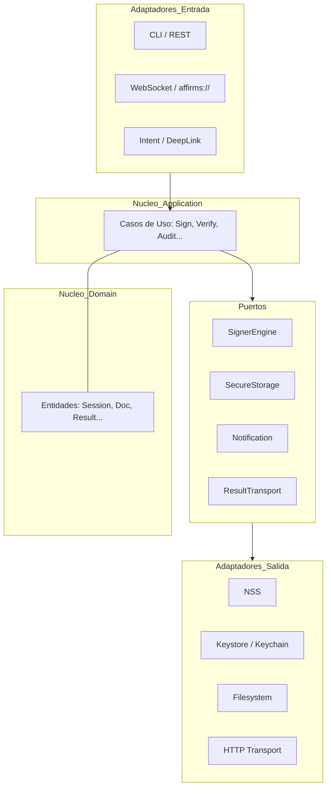

<!-- Derechos de autor (C) 2026 Alberto Avidad Fernández. -->
<!-- Autoría: Alberto Avidad Fernández -->
<!-- Licencia: EUPL 1.2 o posterior -->
<!-- SPDX-License-Identifier: EUPL-1.2 -->

# Arquitectura Técnica — GrxFirma

## Introducción

GrxFirma es una evolución del sistema de firma digital "AutoFirma", diseñado bajo los principios de la **Arquitectura Hexagonal (Puertos y Adaptadores)** para garantizar la independencia de plataforma, la seguridad por diseño y la mantenibilidad a largo plazo.

El sistema se aleja del modelo acoplado a protocolos específicos (`afirma://`, WebSocket) para centrarse en un núcleo de dominio puro que puede ser consumido desde escritorio, móvil o entornos headless.

---

## El Núcleo (Internal)

El núcleo de la aplicación se divide en tres paquetes principales dentro de `internal/`:

### 1. Dominio (`internal/domain`)
Contiene las entidades puras y las reglas de negocio que no cambian independientemente de la tecnología exterior.
- **Entidades**: `Document`, `SignatureResult`, `ExchangeSession` (antes `TransportTicket`), `CertificateRef`.
- **Reglas**: Validación de formatos de firma, lógica de lotes (batching), estados de la sesión de firma.

### 2. Aplicación (`internal/application`)
Implementa los casos de uso coordinando las entidades del dominio y los puertos.
- **Casos de Uso**: `SignDocument`, `ProcessBatch`, `VerifySignature`, `ResolvePlatformProfile`, `AuditOperation`.
- **Orquestación**: Manejo del ciclo de vida de la operación mediante `context.Context`.

### 3. Puertos (`internal/ports`)
Define las interfaces (contratos) que el núcleo necesita para interactuar con el mundo exterior.
- **Salida (Outbound)**: `SignerEngine`, `ResultTransport`, `SecureStorage`, `DesktopNotification`, `MobilePushNotification`, `SmartCardAccess`, `BiometricPrompt`.
- **Entrada (Inbound)**: Definidos implícitamente por los comandos que aceptan los casos de uso.

---

## Adaptadores (Adapters)

Los adaptadores implementan los puertos para tecnologías o plataformas específicas.

### Adaptadores de Entrada (Inbound)
- **Common/Headless**: `cli`, `rest`.
- **Desktop**: `nativehost` (Native Messaging), `qml` (UI multiplataforma) y
  el frontend nativo WinUI, que usa el backend Go mediante IPC local tipado.
- **Mobile**: `android-intent`, `ios-deeplink`.
- **Legacy**: `afirmauri`, `websocket`.

### Adaptadores de Salida (Outbound)
- **Desktop**: `filesystem`, `pkcs11`, `nss`.
- **Mobile**: `android-keystore`, `ios-keychain`, `sandbox-storage`.
- **Common**: `auditlog`, `http-transport`.

---

## Capa Anti-Corrupción (ACL)

Cada adaptador de entrada debe transformar los datos crudos del protocolo externo (ej. parámetros en una URL `afirma://`) a comandos internos del dominio. **Nunca** se debe reutilizar un DTO de integración dentro del núcleo.

---

## Principios de Diseño

1. **Responsabilidad Única de Puertos**: No combinar capacidades no relacionadas (ej. Biometría vs Tarjeta Inteligente) en un mismo contrato.
2. **Degradación Controlada**: Si una plataforma no soporta una capacidad (ej. Servidor Local en Mobile), el núcleo debe operar en modo reducido sin lanzar excepciones estructurales.
3. **Independencia de Mobile**: Mobile se integra mediante `gomobile bind` (ADR-001), tratando a Android e iOS como adaptadores nativos que implementan puertos Go.
4. **Seguridad Centralizada**: La política de confianza y auditoría reside en `application`, no en los frontends.

### Retención y builds de producción

Los adaptadores de salida no pueden conservar diagnósticos de forma
indefinida. `auditlog` limita la auditoría a 90 días, un fichero activo y una
rotación; Qt/QML y `grxfirmauri` limitan las incidencias a 30 días y 50 grupos.
El borrado solo admite artefactos con nombres propios, regulares y contenidos
en el directorio privado correspondiente.

La capacidad de depuración también es una decisión de compilación. El código
común expone `logging.DebugAllowed()` y los empaquetadores públicos usan
`-tags production`; así, ni una variable heredada ni un lanzador externo
pueden elevar el nivel a `DEBUG` en el artefacto distribuido. Las reglas y
límites completos se mantienen en
[POLITICA_RETENCION_Y_DIAGNOSTICO.md](POLITICA_RETENCION_Y_DIAGNOSTICO.md).

### Editor visible PAdES en WinUI

WinUI renderiza primero la página mediante el adaptador nativo
`WindowsPdfPreviewService`, basado en
`Windows.Data.Pdf.PdfDocument`. Este adaptador devuelve PNG y `MediaBox` reales
sin depender de Poppler en el equipo instalado; limita entrada, dimensiones y
salida y no sigue puntos de reanálisis. El puerto de previsualización del
backend se conserva como alternativa cuando el host no inyecta el servicio
nativo.

La zona del sello se conserva en el modelo como porcentajes
X/Y/ancho/alto, no como píxeles de pantalla. El frontend convierte el arrastre
y el redimensionado sobre el `Viewbox` a ese sistema normalizado, limita el
rectángulo al interior de la página y mantiene los controles numéricos como
fuente autoritativa y alternativa de teclado. Antes de firmar se reutilizan las
guardas de identidad del fichero y de geometría de la previsualización; un PDF
modificado obliga a volver a cargarla.

### Frontera Native Messaging

Native Messaging se compone de dos capas anticorrupción y no constituye una
entrada directa al núcleo:

1. La WebExtension autoriza el mensaje usando información de `MessageSender`
   proporcionada por el navegador. El ID debe coincidir con la extensión en
   ejecución. Las páginas internas pueden enumerar, firmar y verificar; una
   página HTTPS incluida en los `host_permissions` publicados solo puede abrir
   el firmador o solicitar `proveIdentity` con el canon y una correlación. Esta
   última acción nunca expone ni acepta un catálogo o identificador de certificado.
   El puente local `https://127.0.0.1:63118` solo puede consumir
   un token pendiente en `/signer` o `/firmador`.
2. El proceso `cmd/nativehost` obtiene la identidad del llamador de los
   argumentos que añade Chrome/Chromium o Firefox, nunca del DTO JSON. Valida
   el origen contra IDs fijos, el ID exacto del paquete y manifiestos ligados
   al mismo ejecutable. En Firefox comprueba además el manifiesto recibido.

El adaptador se compone con `RequireCaller=true`. Exige un `requestId` acotado
y único durante diez minutos, conserva como máximo 4096 IDs y rechaza replay.
Los campos `requestId`, `action`, aplicación y origen se reconstruyen en el
borde de confianza para que una página no pueda sobrescribirlos. El adaptador
traduce el contexto acreditado a `SignCommand.RequesterApplication` y
`SignCommand.RequesterOrigin`; el caso de uso los sanea y los presenta en el
consentimiento sin convertirlos en datos de dominio persistentes.

Para `proveIdentity`, el host exige únicamente `requestId`, `action`,
`canonicalPayloadB64` y `requesterOrigin`, rechaza campos desconocidos y vuelve a
canonicalizar el contrato RFC 8785. La selección del certificado y el consentimiento
se ejecutan en ventanas del sistema localizadas. La extensión reensambla la firma y
comprueba que los metadatos de todos los fragmentos sean coherentes antes de devolver
la prueba minimizada a la página.

Una build `production` no admite el opt-in de callers de desarrollo. Los
manifiestos siguen siendo la primera allowlist del navegador; la validación del
host es una segunda defensa y no autoriza comodines ni rutas alternativas.

### Aviso de nuevas versiones

La comprobación de versiones es una capacidad informativa común del backend
IPC, no un actualizador. `updatecheck.Client` consulta exclusivamente
`https://api.github.com/repos/aavidad/GrxFirma/releases/latest`, compara la
etiqueta estable con la versión inyectada en `main.version` durante el
empaquetado y devuelve un resultado tipado a Qt/QML o WinUI.

La frontera aplica HTTPS, timeout corto, límite de un MiB para la respuesta y
política de redirección restringida al mismo origen. Cuando se usa el endpoint
oficial, el enlace presentado queda anclado a
`https://github.com/aavidad/GrxFirma/releases/tag/`; un valor `html_url`
externo o de descarga directa se rechaza. Una build `dev` o con una versión no
comparable informa de esa condición y no genera un falso aviso.

La interfaz puede hacer una única consulta por proceso al terminar de cargar
las preferencias si `General.checkForUpdates` está habilitado, y ofrece además
una consulta manual. El ajuste se considera habilitado si todavía no existe
para conservar un comportamiento coherente en perfiles nuevos y migrados. Un
fallo de red no bloquea la firma local; la comprobación manual explica cómo
revisar Internet o el proxy y reintentar.

Esta capacidad nunca descarga, instala ni ejecuta artefactos. El usuario revisa
las notas y abre voluntariamente la Release oficial. El repositorio debe
publicar al menos una Release estable accesible sin autenticación: no se
incorpora un token de GitHub al cliente ni se amplían sus permisos para
consultar repositorios privados.

### Contrato de rechazo recuperable

Un `return error` que pueda llegar a una persona no constituye por sí solo una
interfaz válida. Los adaptadores deben conservar un código estable para
diagnóstico y presentar:

- qué condición no se cumple;
- por qué la operación ha fallado de forma cerrada;
- qué acción segura puede realizar el usuario;
- o, si depende de una sede, hardware o administrador, quién debe resolverla.

La corrección propuesta nunca puede consistir en desactivar una validación,
aceptar un certificado inseguro, añadir comodines o reducir la protección del
sistema. Las pruebas de contrato de cada borde deben comprobar tanto el
rechazo como la orientación de recuperación.

---

## Diagrama Conceptual (Mermaid)

La base PKCS#11 no aparece como adaptador productivo en el diagrama porque
ningún binario la inicializa. Su incorporación futura exige completar el flujo
PIN/clave, el aislamiento y las pruebas con hardware real.
