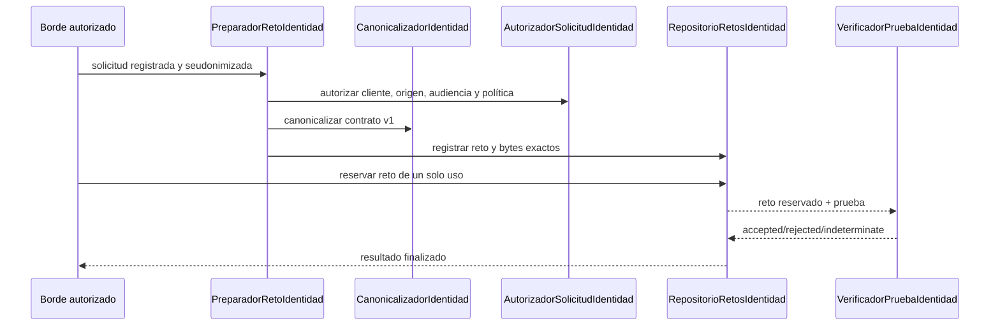

<!-- Derechos de autor (C) 2026 Alberto Avidad Fernández. -->
<!-- Autoría: Alberto Avidad Fernández -->
<!-- Licencia: EUPL 1.2 o posterior -->
<!-- SPDX-License-Identifier: EUPL-1.2 -->

# Identidad reforzada genérica v1

**Estado:** dominio, puertos, coordinación, política, canonicalización, repositorio
efímero, verificación criptográfica, evidencia durable cifrada, adaptador REST
opcional y puente local Native Messaging implementados. El puente está compuesto en
el host y en las fuentes Chromium/Firefox, con pruebas automáticas; todavía no se ha
reconstruido ni publicado un paquete ni repetido una campaña física de navegador para
esta capacidad.

GrxFirma acredita posesión de clave y devuelve evidencia criptográfica. No crea
sesiones de aplicaciones, roles, permisos ni vínculos entre una identidad y una cuenta.
El contrato `identidad-reforzada/v1` es genérico y no contiene identificadores reales
de tenant, usuario o sesión.

## Flujo de programación



La reserva termina antes de invocar el verificador. Por diseño, el puerto no ofrece una
función que mantenga una transacción abierta alrededor de esa llamada externa.

La obtención local de la prueba sigue esta segunda secuencia:

```mermaid
sequenceDiagram
    participant P as Portal HTTPS autorizado
    participant E as WebExtension
    participant N as Host Native Messaging
    participant G as GeneradorPruebaIdentidadLocal
    participant S as Selector local
    participant F as Firmador local
    P->>E: canon Base64 + correlación
    E->>E: acreditar origen mediante MessageSender
    E->>N: proveIdentity + origen reconstruido
    N->>G: reto completo y canon exacto
    G->>G: re-canonicalizar y comparar en tiempo constante
    G->>S: candidatos vigentes, solo dentro del equipo
    S-->>G: certificado elegido explícitamente
    G->>F: consentimiento y firma CAdES detached
    F-->>N: firma y cadena pública utilizada
    N-->>E: prueba fragmentada y códigos estables
    E-->>P: prueba minimizada; nunca catálogo ni identificador local
```

La página no elige ni enumera certificados. El origen procede del navegador, no del
mensaje de la página, y el host vuelve a validar el contrato JSON completo, Base64
canónico, duplicados, tiempos, origen y bytes JCS antes de mostrar el selector.

## Inventario

| Función o método | Responsabilidad |
|---|---|
| `SolicitudRetoIdentidad.Validar` | contrato, enlaces, nonce y tiempos |
| `PruebaIdentidad.Validar` | perfil CAdES detached, algoritmos y tamaños |
| `ResultadoVerificacionIdentidad.ValidarEstructura` | resultado trivalente y controles completos en aceptación |
| `NuevoPreparadorRetoIdentidad` | exige política, canonicalizador y repositorio |
| `PreparadorRetoIdentidad.Preparar` | canonicaliza, limita, copia y registra |
| `NuevoConfirmadorIdentidad` | exige repositorio, verificador y reloj |
| `ConfirmadorIdentidad.Confirmar` | reserva, verifica y finaliza sin aceptar incertidumbre |
| `resultadoIndeterminado` | representa fallos externos sin convertirlos en éxito |
| `copiarSolicitudIdentidad` | copia nonce y normaliza UTC |
| `copiarRetoIdentidad` | copia defensiva del canon y solicitud |
| `copiarPruebaIdentidad` | copia firma, certificado y cadena |
| `copiarMatrizBytes` | evita compartir certificados mutables |
| `identityjcs.ConfiguracionPredeterminada` | versión y máximo gobernados |
| `identityjcs.Nuevo` | construye el adaptador o falla cerrado |
| `identityjcs.Canonicalizar` | genera una copia UTF-8 RFC 8785 |
| `identityjcs.nuevoContrato` | aísla los nombres JSON del dominio |
| `identitypolicy.NuevoCatalogo` | crea una instantánea exacta sin fallback |
| `identitypolicy.Catalogo.Autorizar` | valida cliente, tenant opaco, origen, audiencia, política y TTL |
| `identitypolicy.coincide` | compara todos los atributos gobernados |
| `identitypolicy.registroValido` | rechaza configuración ambigua o insegura |
| `identitymemory.Nuevo` | fija capacidad y retención efímera |
| `identitymemory.Repositorio.Registrar` | copia un reto pendiente único |
| `identitymemory.Repositorio.Reservar` | CAS en memoria con un único ganador |
| `identitymemory.Repositorio.Finalizar` | fija un único resultado terminal |
| `identitymemory.Repositorio.limpiar` | elimina retos caducados de forma acotada |
| `rest.WithIdentidadReforzada` | registra ambos casos de uso o ninguna ruta |
| `rest.authorizeIdentity` | exige autenticación configurada y válida |
| `rest.handleIdentityChallenge` | valida origen y devuelve el canon Base64 |
| `rest.handleIdentityVerification` | adapta la prueba y devuelve resultado trivalente |
| `rest.decodificarIdentidad` | limita cuerpo y rechaza JSON desconocido o duplicado |
| `rest.jsonDuplicado` | detecta claves repetidas en el objeto contractual |
| `rest.nuevaRespuestaVerificacion` | construye el DTO sin decisiones de sesión |
| `signer.validarAlgoritmosSignerInfo` | exige SHA-256 y OID coherente con RSA/ECDSA |
| `identityverifier.Nuevo` | valida y copia EKU, OID y metadatos de aseguramiento |
| `identityverifier.Verificar` | compone CAdES, cadena, vigencia, EKU, política, revocación e identidad acreditada |
| `identityverifier.registrar` | conserva canon, huellas y dictámenes incluso ante rechazo o incertidumbre |
| `identityverifier.comprobarCadenaRevocacion` | consulta cada certificado no raíz con resultado trivalente |
| `identityevidence.Nuevo` | valida clave AES-256 versionada, permisos y cadena HMAC existente |
| `identityevidence.Registro.RegistrarIdentidad` | cifra, encadena, sincroniza y devuelve referencia opaca |
| `identityevidence.verificarRegistro` | impide continuar sobre evidencia manipulada |
| `NuevoGeneradorPruebaIdentidadLocal` | exige canonicalizador, catálogo, selector, firmador y reloj |
| `GeneradorPruebaIdentidadLocal.Generar` | revalida el reto, selecciona localmente y firma el canon exacto |
| `retoLocalValido` | limita origen HTTPS, tamaño, emisión y caducidad |
| `origenIdentidadHTTPSValido` | exige un origen HTTPS puro y normalizado |
| `certificadosVigentes` | filtra y limita candidatos sin exponerlos al portal |
| `certificadoSeleccionadoValido` | vincula la elección con un candidato exacto |
| `nuevaPruebaIdentidadLocal` | convierte la firma y su cadena en el contrato minimizado |
| `nativehost.WithGeneradorPruebaIdentidad` | activa la acción solo al inyectar el caso de uso completo |
| `nativehost.handleIdentityProof` | traduce la petición estricta y devuelve códigos estables |
| `nativehost.retoIdentidadNativo` | reconstruye todo el dominio desde el canon y acredita el origen |
| `nativehost.fragmentarPruebaIdentidad` | transporta firmas grandes con metadatos idénticos por fragmento |
| `nuevoSelectorCertificadoIdentidadSistema` | compone selector gráfico e i18n fuera del núcleo |
| `selectorCertificadoIdentidadSistema.Seleccionar` | mantiene catálogo y elección dentro del escritorio |
| `selectorCertificadoIdentidadSistema.texto` | resuelve las claves de interfaz con reserva segura |
| `seleccionarIndiceCertificadoSistema` | adapta el diálogo nativo de Linux, macOS o Windows |
| `validateNativeIdentityProof` | valida y copia la prueba reensamblada en la extensión |
| `proveIdentityLocal` | serializa una única operación local y llama al host seguro |
| `solicitudValida` | limita el mensaje de página a canon y correlación |
| `procesarSolicitud` | traduce la respuesta a DTO público sin filtrar errores internos |

## Límites operativos

- únicamente `cades-detached` con SHA-256 y RSA PKCS#1 v1.5 o ECDSA en v1;
- el motor CMS rechaza OID de huella o firma incoherentes antes de verificar;
- firma máxima de 512 KiB, certificado máximo de 64 KiB y hasta ocho certificados de cadena;
- canon máximo de 16 KiB;
- `github.com/gowebpki/jcs` fijado en `v1.0.1`, con licencia Apache-2.0 inventariada;
- toda aceptación exige integridad, cadena, vigencia, EKU, política y revocación conformes;
- el catálogo no tiene política por defecto y el repositorio limita pendientes a 4096;
- el repositorio de retos sigue siendo efímero; la evidencia terminal se conserva
  cifrada con AES-256-GCM y encadenada mediante HMAC-SHA-256;
- la clave de evidencia debe proceder de gestión externa, contener 32 bytes y tener
  versión estable; el directorio y el fichero exigen permisos `0700` y `0600`;
- el proceso verifica toda la cadena al arrancar y falla cerrado ante manipulación;
- las rutas REST solo aparecen al inyectar ambos casos de uso y exigen credencial;
- `Origin` debe coincidir exactamente con el origen firmado y registrado;
- OpenAPI elimina las rutas cuando la capacidad no está configurada;
- el protocolo legado que firma solo `SHA-256(nonce)` no satisface este contrato;
- `GRXFIRMA_NATIVEHOST_AUTO_APPROVE` no evita ni la selección ni el consentimiento
  específicos de identidad;
- el puente no tiene fallback REST y solo admite una operación simultánea por página;
- no habilitar la interfaz integradora hasta reconstruir paquetes y superar una prueba
  física completa con host instalado, extensión publicada o gestionada y certificado
  representativo de producción.

Los adaptadores de entrada traducirán códigos estables. El núcleo no contiene mensajes
de interfaz ni selecciona idioma.
